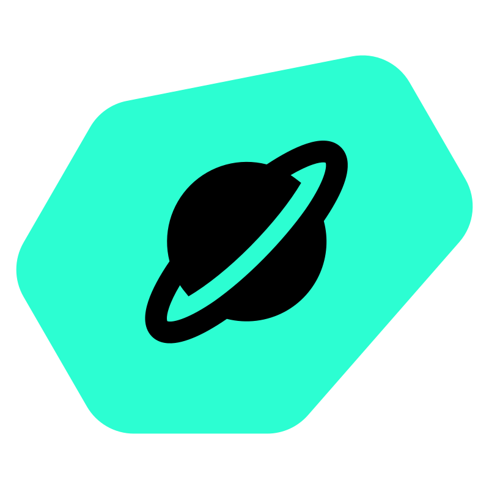

#  copper-rs Human Pose

A [copper-rs](https://github.com/copper-project/copper-rs) task graph in Rust that reads a USB camera, finds human poses with YOLOv8n-pose on the CPU, and serves the results to a [Rerun](https://rerun.io) viewer on your laptop. It is based on the upstream `cu_human_pose` example.

- Cross-compile a copper-rs app (a task graph in `copperconfig.ron`, made into code at build time) into one binary
- Camera input through GStreamer, inference with Candle, no Python and no GPU
- Watch the live camera image and the skeletons from your laptop with `rerun --connect`
- Write the copper-rs log to `/var/lib` on a read-only root filesystem
- See the live task graph in the copper-rs TUI over SSH

The YOLOv8 pose weights are from Ultralytics and use the AGPL-3.0 license. The build downloads them, and they are not in this repository. For a product, get a license from Ultralytics or use your own model.
