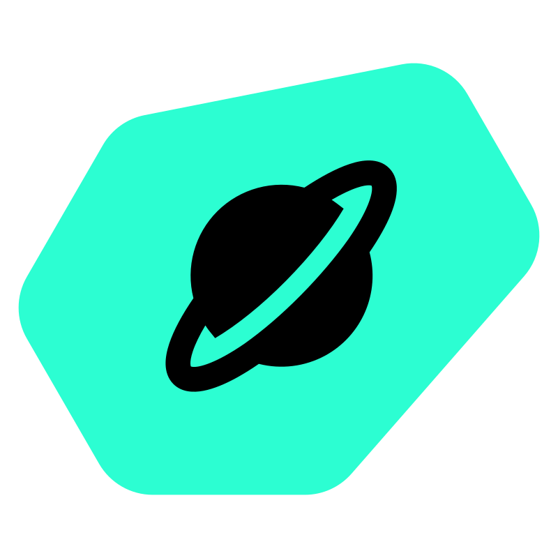

#  Getting Started with NVIDIA DeepStream

Run DeepStream 9.1 natively on a Jetson Orin Nano (or AGX Orin) — no containers. A USB camera is fed through a GStreamer pipeline that detects people with PeopleNet, tracks them across frames with NvDCF, runs MoveNet (secondary GIE) to extract a 17-point COCO skeleton per person, runs YOLOX-Body-Head-Hand (second primary GIE) on the full frame to find hands, runs MediaPipe Hand Landmark (tertiary GIE) on each hand crop to regress 21 finger keypoints, and applies `nvdsanalytics` for ROI entry counters and dwell-time tracking. Bounding boxes, skeletons, hand keypoints, and zone overlays are rasterised by `nvdsosd` directly into the JPEG stream; the dashboard at `:8080` serves the resulting MJPEG plus a JSON stats endpoint.

## Prerequisites

- macOS 10.12+ or Linux (Ubuntu 22.04+, Fedora 39+) on the build machine
- [Docker Desktop](https://www.docker.com/products/docker-desktop/) or a working local Docker daemon (the Avocado SDK runs in a container)
- The latest [Avocado CLI](https://docs.peridio.com/guides/avocado-cli/overview)
- A Jetson Orin Nano DevKit or Jetson AGX Orin DevKit
- A USB C cable
- A UART to USB adapter
- A USB camera (UVC-compatible MJPEG, e.g. Logitech C920 / C270)
- A network-reachable path from a viewing machine to the device
- Internet access on the build machine — `models-compile.sh` downloads four models on the first build (PeopleNet from NGC; MoveNet, YOLOX-Body-Head-Hand, and MediaPipe Hand Landmark from PINTO mirrors; ~270 MB the first time, then cached)

## Initialize

```bash
avocado init --reference nvidia-deepstream nvidia-deepstream
cd nvidia-deepstream
```

To target Jetson AGX Orin instead of Orin Nano:

```bash
avocado init --reference nvidia-deepstream --target jetson-agx-orin-devkit nvidia-deepstream
cd nvidia-deepstream
```

## Install

```bash
avocado install -f
```

Downloads the Avocado SDK container and the runtime extensions declared in `avocado.yaml` (DeepStream 9.1, TensorRT, CUDA, cuDNN, the GStreamer NVIDIA plugins, Python).

## Build

```bash
avocado build
```

`models-compile.sh` (the `vision-models` extension's compile hook) runs inside the SDK and stages four ONNX models into `vision-models/overlay/usr/lib/nvidia-deepstream/models/`:

1. **PeopleNet** ONNX + labels from NGC (Person/Bag/Face detector). Used as the primary GIE.
2. **MoveNet** (single-pose Lightning) from PINTO's ONNX zoo — extract just `model_float32.onnx` and rewrite its input layer from NHWC to NCHW (a small `onnx.helper` Transpose insertion) so DS 9.1's `nvinfer` reads it cleanly. Used as secondary GIE on each Person crop for the 17-point body skeleton.
3. **YOLOX-Body-Head-Hand (320×320, non-post variant)** from PINTO — used as a second primary GIE on the full camera frame to find hands. The Python pad probe decodes the raw head output (grid + log-space + sigmoid) and applies per-class NMS in app.py.
4. **MediaPipe Hand Landmark sparse (224×224)** from PINTO's `hand_landmark` GitHub release — used as tertiary GIE on each detected hand crop to produce 21 finger keypoints + handedness + presence score.

`models-install.sh` copies those into the `vision-models` extension sysroot. Separately, `engines-compile.sh` (the `vision-engines` hook) stages the prebuilt TensorRT engines for the current build target from `prebuilt-engines/<target>/` into `vision-engines`. `avocado build` finishes by assembling all five extensions (see the *Extension layout* section in the README). Flask, PyGObject, and the rest of the Python runtime come from the Avocado package feed via the `vision-runtime` extension (`python3-flask`, `python3-pygobject`) — no pip install step is involved.

## Deploy

```bash
avocado provision -r dev --profile tegraflash
```

Follow the USB recovery-mode prompts. Plug in your USB camera before or after boot.

## First boot — engines

The reference ships **prebuilt TensorRT FP16 `.engine` files** for the supported targets under `prebuilt-engines/<target>/<model>/`. `engines-compile.sh` stages the engines for the current build target into the `vision-engines` extension at `/usr/lib/nvidia-deepstream/engines/<model>/`, and the nvinfer configs point straight at that read-only path. At service start nvinfer memory-maps the engine and the pipeline reaches PLAYING in ~10–15 s. There is **no on-device compile and no `/var` staging** — the engine is loaded, dm-verity-verified, directly from the extension.

Because there is no on-device compile path (nowhere writable to build into on an immutable OS), **every supported target must ship a prebuilt engine for every model**. `engines-compile.sh` fails the build if an engine is missing for the target rather than silently producing an image that can't start. To add a target, build and commit its engines first — see [Regenerating engines](#regenerating-engines).

### Why per-target engines?

TensorRT engines are pinned to GPU compute capability (sm_87 for both Orin Nano and AGX Orin) **and** the device's SM count, memory hierarchy, and TRT/CUDA version. Engines built for an Orin Nano won't necessarily run optimally (or at all) on an AGX Orin. The directory layout reflects that:

```
prebuilt-engines/
├── jetson-orin-nano-devkit/{peoplenet,movenet,handdet,handlandmark}/*.engine
└── jetson-agx-orin-devkit/{...}/*.engine     # populate from an AGX Orin
```

### Regenerating engines

To regenerate or refresh engines (e.g. after a JetPack bump that invalidates them, or to add a new target):

1. SSH to a device running the target hardware + the matching JetPack/TRT version.
2. Build an FP16 engine for each ONNX in a writable working dir (e.g. with `trtexec`, or a scratch nvinfer config pointed at a writable `onnx-file`). The output filenames follow nvinfer's `<onnx-basename>_b1_gpu0_fp16.engine` convention.
3. `scp` the engines back to the host under the right `prebuilt-engines/<target>/<model>/` directory and commit them.
4. Next `avocado build` stages them into `vision-engines`; next `avocado runtime deploy` ships them OTA.

### OTA-ing engines

A new engine ships as a new version of the `vision-engines` extension. On the next boot the updated extension is merged read-only at `/usr/lib/nvidia-deepstream/engines/` and nvinfer mmaps the new engine — there is no cached `/var` copy to reconcile. The extension's `on_merge` hook runs `systemctl try-restart vision-app.service`, so the app picks up the new engine without a manual reboot.

### Provision vs deploy

A full `avocado provision` (tegraflash reflash) writes all extensions fresh. An `avocado runtime deploy` only swaps the changed sysext/confext A/B partitions — e.g. just `vision-engines` or `vision-models` — and the new artifact is live on next boot. Neither path stages anything into `/var`; engines and models are always read directly from their read-only extensions.

Flask doesn't bind port 8080 until `_start_pipeline()` returns, which waits for all four GIEs' engines to be loaded. If `http://<device-ip>:8080` is unreachable on first boot, check `journalctl -u vision-app -f` to see which engine nvinfer is on.

## Verify

SSH into the device. The root account has an empty password for development:

```bash
ssh root@<device-ip>
```

### Service is running

```bash
systemctl status vision-app
```

`Active: active (running)`.

### Pipeline produced frames

```bash
journalctl -u vision-app -b --no-pager | tail -30
```

Look for `setting pipeline to PLAYING` and (after the engine build) `dashboard: http://0.0.0.0:8080`.

### Dashboard + live MJPEG stream

From any machine on the same network:

- Browser: `http://<device-ip>:8080` — live video with bounding boxes + per-object tracker IDs, plus an FPS / detection / track stats panel.
- Raw stream: `http://<device-ip>:8080/stream`
- JSON: `curl http://<device-ip>:8080/api/stats | jq`

Expected on Orin Nano at 720p: ~15–25 fps end-to-end with 1–2 people in frame. AGX Orin pushes 30+ fps comfortably.

### Track IDs persist across frames

Walk in and out of the frame; you should see the tracker assign a unique `id` per person (e.g. `id 1`, `id 2`) and keep it stable while the person stays visible. `unique_tracks` in the stats panel monotonically increases each time a new person enters.

## Customize

### Adapting to your camera

The defaults assume a UVC USB webcam that can stream **MJPEG at 1280×720, 30 fps**. If your camera is different, the workflow is:

**1. See what your camera can actually do.** SSH in and ask v4l2:

```bash
v4l2-ctl --list-devices
v4l2-ctl --device /dev/video0 --list-formats-ext
```

The first command shows which `/dev/video*` node your camera is on. The second prints every pixel format / resolution / framerate the camera supports. Look for an `MJPG` entry at the resolution and framerate you want.

**2. Override the defaults with a systemd drop-in.** No rebuild — write the file once on the device and `systemctl restart vision-app`:

```bash
systemctl edit vision-app
```

```ini
[Service]
Environment=CAMERA_DEVICE=/dev/video1
Environment=CAMERA_WIDTH=640
Environment=CAMERA_HEIGHT=480
Environment=CAMERA_FRAMERATE=30
```

The app reads these on startup and rebuilds the pipeline string with the new values — no other edits needed.

**3. If your camera doesn't list `MJPG`** (some webcams only do `YUYV`), the default pipeline can't negotiate. The fix is to change `_build_pipeline()` in `app.py` from the JPEG path:

```python
f"! image/jpeg,width={WIDTH},height={HEIGHT},framerate={FRAMERATE}/1 "
f"! jpegdec "
f"! videoconvert "
```

to a raw path:

```python
f"! video/x-raw,format=YUY2,width={WIDTH},height={HEIGHT},framerate={FRAMERATE}/1 "
f"! videoconvert "
```

(GStreamer calls YUYV `YUY2`.) Rebuild + redeploy.

**4. If you change the resolution, rescale the Center zone.** The ROI polygon in `analytics_config.txt` is in pixel coordinates of the configured frame. The defaults (`400;180;880;180;880;540;400;540`) are for 1280×720; at 640×480 the rectangle ends up mostly off-screen. Edit those four corner points in `vision-config/overlay/etc/nvidia-deepstream/analytics_config.txt` to whatever you want, then rebuild + redeploy. A simple starting point is a centered rectangle covering roughly the middle 50% of the frame.

**5. Other camera sources.** This reference uses `v4l2src` for USB UVC cameras. For a Jetson **CSI** camera, swap `v4l2src` for `nvarguscamerasrc` and adjust the caps (CSI cameras typically expose `video/x-raw(memory:NVMM),format=NV12` directly, so the `jpegdec` and first `videoconvert` aren't needed). For an **RTSP / IP** camera, use `rtspsrc location=rtsp://… ! rtph264depay ! h264parse ! nvv4l2decoder`. Everything downstream of `nvstreammux` is the same regardless of source.

### Swap the detection model

PeopleNet detects person/bag/face. Other DeepStream-compatible TAO models that drop in with minimal config changes:

- **TrafficCamNet** (4-class: car/person/bicycle/roadsign) — included with DeepStream's `samples` package
- **DashCamNet** (4-class, dashcam-tuned)
- **YOLOv8** ONNX exports — needs a custom output parser

Edit `config_infer_peoplenet.txt` to point at the new ONNX + label file and rebuild.

### Add a secondary classifier

DeepStream's secondary GIE pattern lets you chain models — e.g., PeopleNet detects people, then a secondary model classifies each person's action / pose / clothing. Add another `nvinfer` element after the tracker with `process-mode=2`. See NVIDIA's `deepstream_test2_app_config.txt` for the canonical example. This reference already uses the pattern: MoveNet runs as a secondary GIE on each PeopleNet person bbox; see *Pose tracking* below.

### Pose tracking

MoveNet (Google, single-pose Lightning variant; ONNX from PINTO's pre-converted model zoo) runs as a **secondary GIE** with `gie-unique-id=2`, `process-mode=2`, `operate-on-gie-id=1`, `operate-on-class-ids=0` — so it only fires on the Person crops PeopleNet produces. Its output tensor (`[1, 1, 17, 3]` — `(y_norm, x_norm, confidence)` per COCO keypoint) is delivered as `NvDsInferTensorMeta` on each object meta (because `output-tensor-meta=1` is set and `network-type=100` disables nvinfer's built-in post-processing).

The pad probe reads each tensor via `tensor_meta.out_buf_ptrs_host` (the canonical pyds path — a `void**` `PyCapsule` that we walk with `ctypes`), drops any keypoint below `KEYPOINT_CONFIDENCE = 0.30` (set in `app.py`), projects the survivors back into image-pixel coordinates using the bbox, and attaches an `NvDsDisplayMeta` containing the joint circles + bone lines. `nvdsosd` rasterises that display meta into the same frame it paints the bbox onto, before `nvjpegenc` encodes the JPEG — so the skeleton arrives at the dashboard at the full pipeline frame rate inside the MJPEG stream itself, with no client-side rendering.

Knobs you'll likely touch:

- **`KEYPOINT_CONFIDENCE`** (in `app.py`) — raises/lowers the per-keypoint threshold. Lower values draw more joints but with more jitter on far-away or partially occluded people.
- **`input-object-min-width` / `input-object-min-height`** (in `config_infer_movenet.txt`) — drops MoveNet entirely on small detections. The defaults (`64 / 128`) keep the secondary inference off of distant or barely-visible people.
- **`interval`** (in `config_infer_movenet.txt`) — set to `1` or `2` to skip frames between pose inferences on the same tracker ID if the secondary GIE is dragging the overall framerate down on busy scenes. The tracker carries the ID across the skipped frames, so the skeleton just lags a beat behind the bbox.
- **`ENABLE_POSE=0`** (systemd drop-in) — drops the MoveNet secondary GIE from the pipeline entirely for benchmarking the detection/tracker pipeline alone.
- **`ENABLE_HANDS=0`** (systemd drop-in) — drops the YOLOX hand-detector and MediaPipe hand-landmark GIEs entirely; useful for benchmarking, or when you only care about bodies and skeletons.
- **Toggle at runtime**: the skeleton, hand, and zone overlays all default to **off**. The dashboard's *Show skeletons* button `POST`s to `/api/toggle/skeletons` (and *Show hands* / *Show zones* to `/api/toggle/hands` and `/api/toggle/zones`), flipping a server-side flag the pad probe consults each frame. No service restart required; the current state is reported in `/api/stats` under `pose.overlay_enabled`.

Swap MoveNet for a different pose model by replacing `vision-models/overlay/usr/lib/nvidia-deepstream/models/movenet/movenet_singlepose_lightning.onnx` with another single-person top-down ONNX (and committing a matching engine under `prebuilt-engines/<target>/movenet/`) (any model that emits `[1, 1, N, 3]` keypoint outputs in normalised coords) and updating `KEYPOINT_NAMES` + `SKELETON_EDGES` to match. For multi-person bottom-up models (e.g., BodyPoseNet), you'd swap the primary GIE *and* add heatmap/PAF parsing — that's a separate reference rather than a config change.

### Output RTSP instead of MJPEG

DeepStream-idiomatic. Replace the appsink branch in `_build_pipeline()` with:

```
! nvvideoconvert ! nvv4l2h264enc ! h264parse ! rtspclientsink location=rtsp://...
```

…or use `gst-rtsp-server` to host the stream on the device. The Flask MJPEG approach in v1 is for "open it in a browser" simplicity.

### Adjust tracker behavior

`/etc/nvidia-deepstream/tracker_NvDCF.yml` is the NvDCF perf config — biased toward speed over IoU accuracy. For more aggressive ID persistence, switch to NVIDIA's `config_tracker_NvDCF_accuracy.yml` (shipped under DeepStream's samples directory). For the lightest tracker (IoU only, no visual features), use `config_tracker_IOU.yml`.

### Configure analytics zones

`nvdsanalytics` runs after the tracker and turns detections into operational metrics — without any extra inference. The shipped config (`/etc/nvidia-deepstream/analytics_config.txt`) defines:

- **Line crossing — `Entry`**: a vertical line through the center of a 1280×720 frame; people crossing left-to-right are counted as `Entry`, right-to-left in the reverse direction. Format: `line-crossing-<Name>=lx1;ly1;lx2;ly2;dx1;dy1;dx2;dy2` (line endpoints, then a direction-of-entry segment). **Ships disabled (`enable=0`)** — a single line is noisy with a head-on webcam, so `line_crossings` stays empty until you set `enable=1` on the `[line-crossing-stream-0]` block. The ROI dwell tracking below is what's on by default.
- **ROI — `Center`**: a centered rectangle covering roughly the middle ~50% of the frame. Any tracked person inside the polygon shows up in the buffer's `NvDsAnalyticsObjMeta` for that frame; `app.py` maintains per-tracker dwell timers on top of that membership signal.
- **Disabled examples** for `overcrowding` and `direction` filters — uncomment + edit to enable.

The results are surfaced two ways:

- **Painted onto the live MJPEG** by `app.py`: when the dashboard's *Show zones* button is on, the pad probe attaches an `NvDsDisplayMeta` for each ROI/line and `nvdsosd` rasterises it onto the video. `nvdsanalytics` itself runs with `osd-mode=0` and paints nothing — the overlay is driven by the app, defaults to off, and is toggled at runtime via `/api/toggle/zones` (no restart).
- **Exposed in `/api/stats`** under `analytics`:

  ```json
  "analytics": {
    "line_crossings": {"Entry": 42},
    "line_crossings_last_frame": {"Entry": 1},
    "rois": {
      "Center": {
        "current": [{"tracker_id": 17, "elapsed_seconds": 8.2}],
        "current_count": 1,
        "total_entries": 27,
        "completed_count": 12,
        "avg_dwell_seconds": 7.4,
        "max_dwell_seconds": 23.6,
        "recent_completed": [{"tracker_id": 16, "duration_seconds": 14.5}, ...]
      }
    }
  }
  ```

Coordinates in the config are in the pipeline's frame space (1280×720 by default). If you override `CAMERA_WIDTH` / `CAMERA_HEIGHT` via a systemd drop-in, rewrite the coordinates accordingly (or rescale linearly).

#### Add a new line or ROI

Edit `vision-config/overlay/etc/nvidia-deepstream/analytics_config.txt` (in the reference repo, not on the device — it's a read-only confext at runtime), increment the stream-suffix block if you want a second line on the same stream, or duplicate the `[line-crossing-stream-0]` / `[roi-filtering-stream-0]` sections under fresh names. After rebuild + redeploy, both the painted overlay and the JSON endpoint will pick up the new zones automatically — `app.py` reads zone names from the metadata at runtime, it doesn't hardcode them.

### Rebuild after changes

After editing `app.py`, the nvinfer config, or the tracker config:

```bash
avocado build
avocado runtime deploy dev --device root@<device-ip>
```

`avocado deploy` streams just the changed sysext bytes; no re-flash.

For changes to `avocado.yaml` (new packages, new extensions), or for first-time deploy:

```bash
avocado build
avocado provision -r dev --profile tegraflash
```

## How the pipeline works

```
v4l2src ─► [MJPEG decode] ─► videoconvert ─► nvvideoconvert (NV12 NVMM) ─►
nvstreammux ─► nvinfer/primary (PeopleNet) ─► nvtracker (NvDCF) ─►
nvdsanalytics (ROIs) ─► nvinfer/secondary (MoveNet) ─►
nvinfer/secondary (YOLOX-Hand) ─► nvinfer/tertiary (MediaPipe Hand Landmark) ─►
nvvideoconvert ─► nvdsosd ─► nvjpegenc ─► appsink → MJPEG/Flask
```

(The two hand GIEs are dropped from the pipeline when `ENABLE_HANDS=0`, and
the MoveNet secondary is dropped when `ENABLE_POSE=0`.)

- **`v4l2src` + `jpegdec`** — capture from USB camera, decode MJPEG to raw frames (software path; switch to `nvjpegdec` for hardware decode).
- **`nvstreammux`** — bridges to DeepStream's batched processing model. Even with one source it's required.
- **`nvinfer/primary`** — runs the PeopleNet TensorRT engine on every frame. Output is detection metadata (bboxes + class IDs) attached to the GStreamer buffer.
- **`nvtracker`** — assigns persistent IDs to detected objects across frames. Uses the NvDCF tracker (correlation filter + visual features).
- **`nvdsanalytics`** — pure metadata processing over the tracker IDs. Evaluates the ROI definitions in `analytics_config.txt` and writes results back into the buffer as `NvDsAnalyticsFrameMeta` (per-ROI occupancy) and `NvDsAnalyticsObjInfo` (per-object ROI membership). Zero extra inference cost.
- **`nvinfer/secondary` (MoveNet)** — runs on each person crop (`process-mode=2`, `operate-on-class-ids=0`). Output keypoints arrive as `NvDsInferTensorMeta` on each object meta (`output-tensor-meta=1`, `network-type=100`); the pad probe converts them to image-pixel coordinates and attaches an `NvDsDisplayMeta` with bone lines + joint circles. Dropped when `ENABLE_POSE=0`.
- **`nvinfer` (YOLOX-Body-Head-Hand)** — runs on the full frame to find hands. A pad probe on its src pad decodes the raw YOLOX output (grid + log-space + sigmoid) and applies per-class NMS, attaching each hand as an object for the tertiary GIE to operate on.
- **`nvinfer/tertiary` (MediaPipe Hand Landmark)** — runs on each hand crop, emitting 21 finger keypoints + handedness as `NvDsInferTensorMeta`; the probe projects them to image pixels and attaches `NvDsDisplayMeta`. Both hand GIEs are dropped when `ENABLE_HANDS=0`.
- **`nvdsosd`** — rasterises everything onto the frame in one pass: bounding boxes (with the border colour the probe set based on ROI membership), ROI / line geometry if `analytics_config.txt`'s `osd-mode` is non-zero, and all the `NvDsDisplayMeta` shapes the probe attached (the skeletons).
- **`nvjpegenc`** — encodes the final composited frame to JPEG using NVIDIA's hardware JPEG encoder, fed straight from NVMM NV12. Keeps OpenCV / numpy off the dependency list and avoids a BGR → JPEG re-encode round-trip in Python.
- **`appsink`** — emits pre-encoded JPEG buffers to Python, which the MJPEG stream relays verbatim. A pad probe on `nvdsosd`'s sink also reads the detection + analytics + tensor metadata to populate the `/api/stats` JSON.

The detection metadata travels through the pipeline as `NvDsBatchMeta` attached to each buffer; the Python app reads it via the `pyds` bindings. Frame pixels travel separately and end up in the appsink.

## Storage layout

| Location | Extension | Contents | Persistence |
|---|---|---|---|
| `/usr/lib/nvidia-deepstream/models/<model>/` | `vision-models` | the four ONNX files (+ PeopleNet `labels.txt`) | Read-only in sysext; updated via OTA |
| `/usr/lib/nvidia-deepstream/engines/<model>/` | `vision-engines` | prebuilt TensorRT FP16 engines for the build target | Read-only in sysext; updated via OTA |
| `/etc/nvidia-deepstream/` | `vision-config` | nvinfer + tracker + analytics configs | Read-only in confext; updated via OTA |
| `/usr/local/bin/app.py` | `vision-app` | the Python application | Read-only in sysext; updated via OTA |
| `/usr/libexec/avocado-deepstream-preflight.sh` | `vision-app` | GStreamer plugin-scan curation (run by systemd at start) | Read-only in sysext; updated via OTA |
| DeepStream / CUDA / TensorRT / GStreamer / Python | `vision-runtime` | platform packages from the Avocado feed | Read-only in sysext; updated via OTA |

Nothing in this reference is staged to `/var`: models and engines are read directly from their
read-only extensions, so an A/B extension swap fully replaces them and there is no mutable
per-device copy to reconcile. The only runtime-writable state is the curated GStreamer plugin
directory under `/run` (tmpfs), rebuilt on every start.
